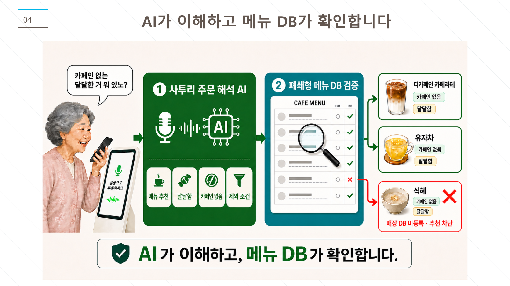
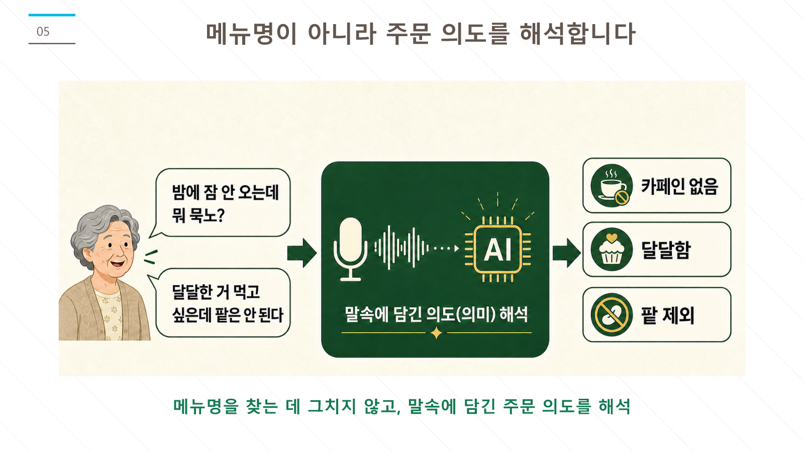
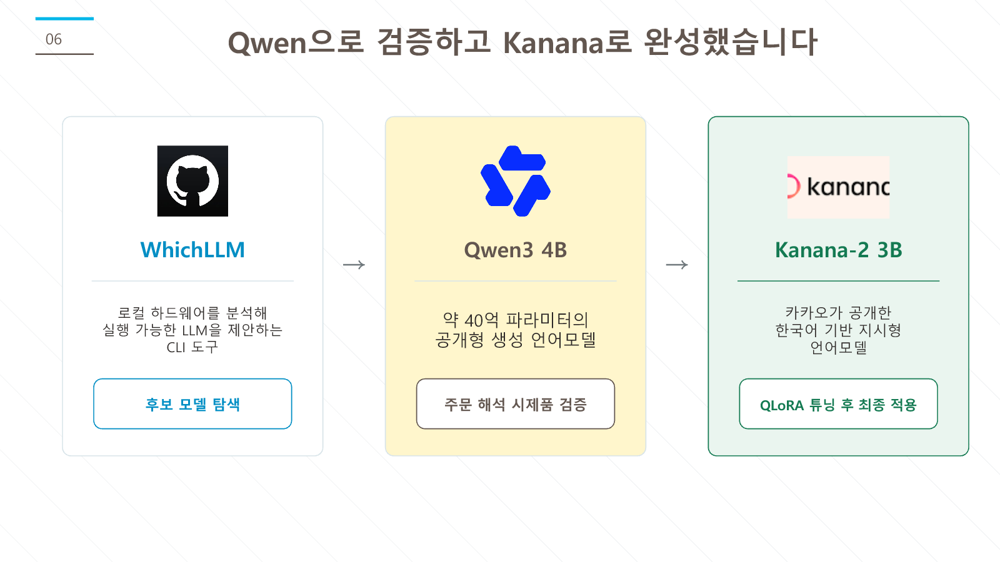
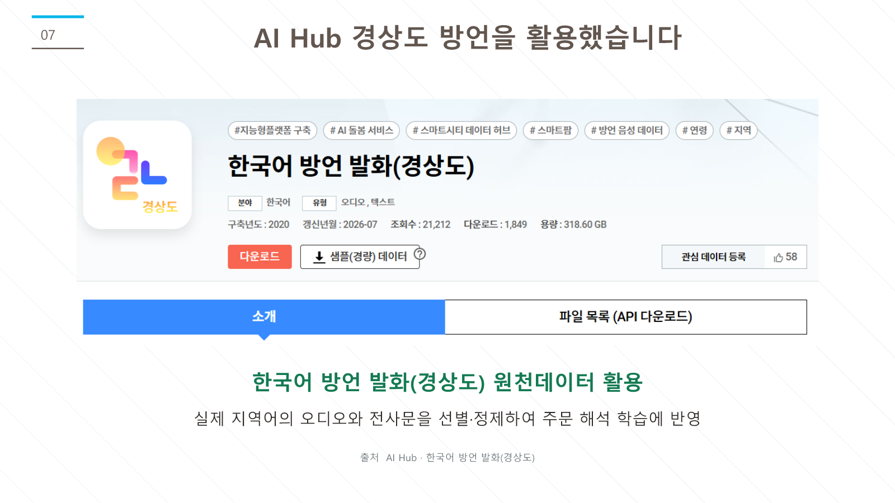
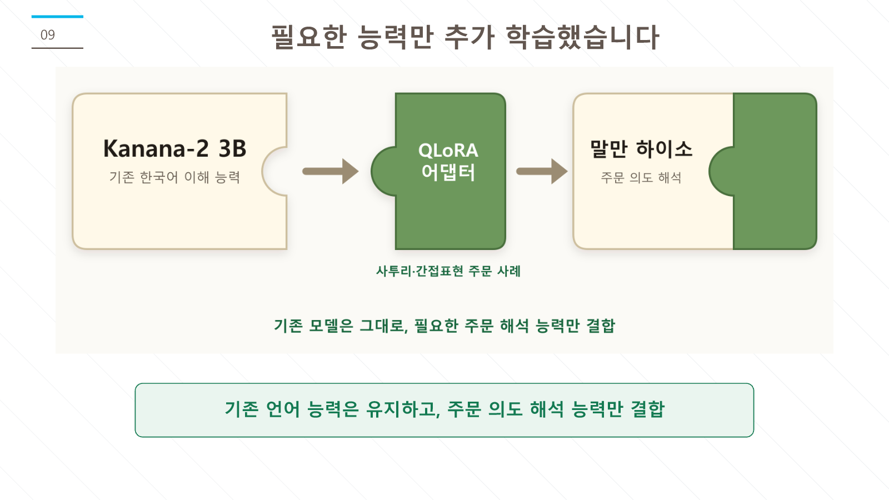

# 말만 하이소

> 메뉴를 잘 몰라도, 평소처럼 말하면 되는 음성 주문 키오스크 제안

경상도 사투리와 간접적인 주문 표현을 해석하고, **매장에 실제 등록된 메뉴 안에서만** 추천·주문을 돕는 카페 키오스크 시제품이다. 사용자가 기계의 메뉴 구조를 먼저 익히는 대신, 기계가 사용자의 말과 조건을 이해하는 경험을 제안한다.

[서비스 체험하기](https://malman-hahiso-2026.moon-hee.chatgpt.site/#experience)

## 프로젝트 소개

이 프로젝트는 **「나는 Solo AI」 공모전** 참여를 위해 제안한 아이디어를 작동하는 시제품으로 구체화한 결과물이다. 1인 개발 과정에서 기획, 화면·API 설계, 데이터 구조화, 로컬 모델 연동과 문서화에 **OpenAI Codex**를 협업 도구로 활용했다. 최종 판단과 방향 설정, 데이터 구성 및 발표 내용 검토는 프로젝트 참여자가 수행했다.



## 왜 만들었나

키오스크의 메뉴·옵션 구조가 낯선 사용자는 원하는 것을 알고 있어도 주문을 포기하기 쉽다. 말만 하이소는 “카페인 없는 달달한 거 뭐 있노?”처럼 메뉴명보다 **조건과 의도**가 먼저 나오는 말을 받아, 주문 가능한 후보를 보여주는 방식이다.



## 핵심 기능

- 사투리와 간접 표현이 담긴 주문 의도를 해석
- 단순·옵션·복수 주문·정정 발화·재질문 상황을 구분
- 폐쇄형 메뉴 DB로 현재 판매 중인 메뉴와 옵션만 검증
- 등록되지 않은 메뉴는 주문으로 확정하지 않고 확인을 요청
- 음성 입력과 텍스트 입력을 모두 지원하는 로컬 추론 API

## 구성

```text
사용자 음성/텍스트
        ↓
사투리 주문 해석 모델 (Kanana-2 3B + QLoRA 어댑터)
        ↓
카페 메뉴 DB 검색·검증
        ↓
추천 메뉴 또는 확인 질문
```



로컬 환경에서 후보 모델을 비교한 뒤 Qwen3 4B로 주문 해석 시제품을 먼저 확인했고, 최종 시범 모델은 한국어 주문 표현을 중심으로 QLoRA 조정한 Kanana-2 3B를 사용했다. 모델 본체와 어댑터는 용량 및 배포 조건상 저장소에 포함하지 않는다.

## 데이터

| 구분 | 공개 여부 | 내용 |
| --- | --- | --- |
| 카페 주문 사례 200건 | 포함 | 프로젝트에서 직접 구성한 학습·점검용 JSON |
| 시범 카페 메뉴 DB | 포함 | 메뉴, 재료, 맛·온도 태그, 허용 옵션 |
| AI Hub 경상도 방언 데이터 | 미포함 | 방언 학습·검토에 활용, 원천 파일은 이용 조건에 따라 별도 수집 |
| 모델·어댑터·체크포인트 | 미포함 | 대용량 산출물 |

자세한 데이터 구분과 AI Hub 출처는 [데이터 안내](docs/DATA.md)를 참고한다.



## 분리 주문 사례 점검

프로젝트에서 분리한 카페 주문 사례 20건으로 최종 점검했을 때 18건이 기대한 주문 형식과 정확히 일치했다(90%). 이 수치는 제한된 시범 데이터에서의 결과이며, 실제 매장 환경 성능을 보장하는 수치는 아니다.



## 저장소 구조

```text
backend/
  app/                         FastAPI 기반 주문 해석·메뉴 검증 API
  data/
    order_cases_cafe_200.json  직접 구성한 카페 주문 사례 200건
    menu_cafe.json             시범 카페 메뉴 DB
    eval_cases.json            점검 사례
  train_kanana_qlora.py        QLoRA 학습 스크립트
assets/                        발표에 사용한 프로젝트 도식
docs/DATA.md                   데이터 출처·제외 항목 안내
```

## 로컬 실행 개요

Python 가상환경을 만든 뒤 아래처럼 API 의존성을 설치한다.

```powershell
cd backend
python -m venv .venv
.\.venv\Scripts\Activate.ps1
pip install -r requirements.txt
```

`.env.example`을 `.env`로 복사한 뒤 로컬 모델 및 어댑터 경로를 설정한다. 이후 FastAPI 서버는 다음과 같이 실행한다.

```powershell
uvicorn app.main:app --host 127.0.0.1 --port 8000
```

학습 재현에는 `requirements-train.txt`와 AI Hub에서 직접 수집한 원천 데이터, 별도 모델 접근 권한이 필요하다.

## 주의

- 이 저장소의 카페 메뉴와 주문 사례는 시범 서비스용이다.
- 공개 터널 주소나 로컬 모델 경로, 접근 토큰은 커밋하지 않는다.
- 실제 서비스에서는 음성 보관·삭제 정책, 사용자 동의, 메뉴 DB 관리 기능을 별도로 갖춰야 한다.
